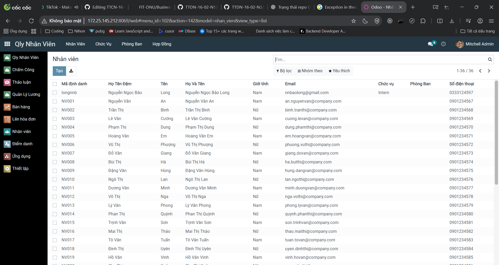
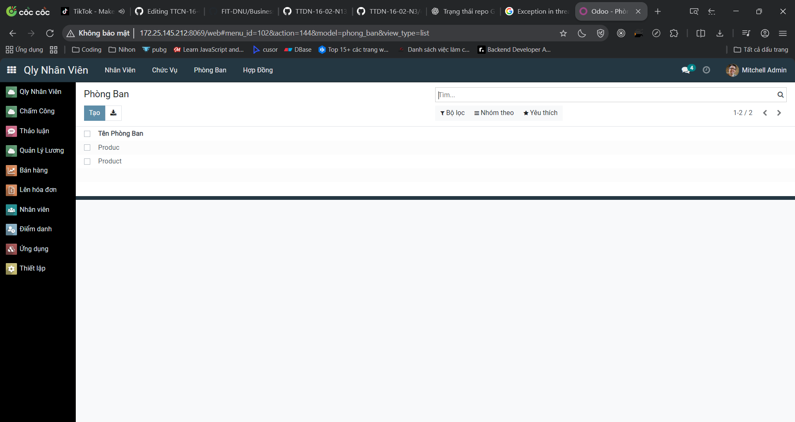
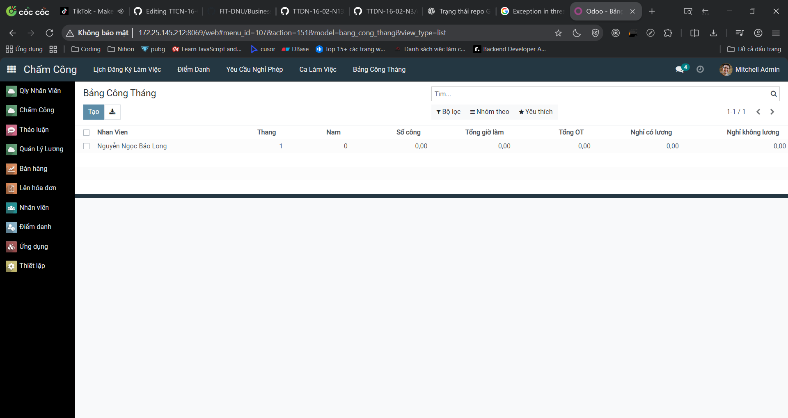
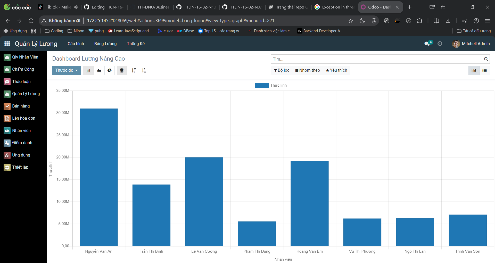
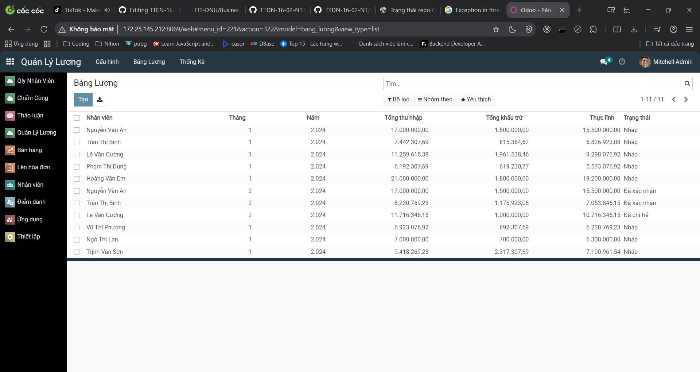
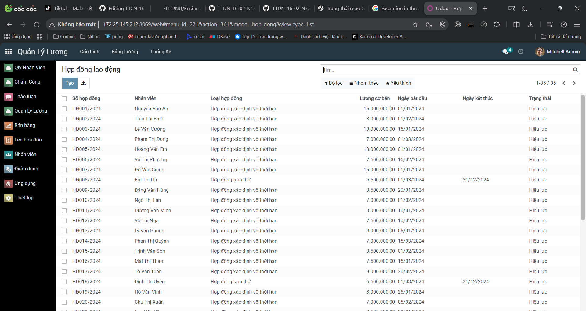

<h2 align="center">
    <a href="https://dainam.edu.vn/vi/khoa-cong-nghe-thong-tin">
    🎓 Faculty of Information Technology (DaiNam University)
    </a>
</h2>
<h2 align="center">
    PLATFORM ERP
</h2>
<div align="center">
    <p align="center">
        
        
        
    </p>

[](https://www.facebook.com/DNUAIoTLab)
[](https://dainam.edu.vn/vi/khoa-cong-nghe-thong-tin)
[](https://dainam.edu.vn)

</div>

## 📖 1. Giới thiệu
Platform ERP được áp dụng vào học phần Thực tập doanh nghiệp dựa trên mã nguồn mở Odoo. 

## 🔧 2. Các công nghệ được sử dụng
<div align="center">

### Hệ điều hành
[](https://ubuntu.com/)
### Công nghệ chính
[](https://www.odoo.com/)
[](https://www.python.org/)
[](https://developer.mozilla.org/en-US/docs/Web/JavaScript)
[](https://www.w3.org/XML/)
### Cơ sở dữ liệu
[](https://www.postgresql.org/)
</div>

## ⚙️ 3. Cài đặt

### 3.1. Cài đặt công cụ, môi trường và các thư viện cần thiết

#### 3.1.1. Tải project.
```
git clone https://github.com/FIT-DNU/Business-Internship.git
```
#### 3.1.2. Cài đặt các thư viện cần thiết
Người sử dụng thực thi các lệnh sau đề cài đặt các thư viện cần thiết

```
sudo apt-get install libxml2-dev libxslt-dev libldap2-dev libsasl2-dev libssl-dev python3.10-distutils python3.10-dev build-essential libssl-dev libffi-dev zlib1g-dev python3.10-venv libpq-dev
```
#### 3.1.3. Khởi tạo môi trường ảo.
- Khởi tạo môi trường ảo
```
python3.10 -m venv ./venv
```
- Thay đổi trình thông dịch sang môi trường ảo
```
source venv/bin/activate
```
- Chạy requirements.txt để cài đặt tiếp các thư viện được yêu cầu
```
pip3 install -r requirements.txt
```
### 3.2. Setup database

Khởi tạo database trên docker bằng việc thực thi file dockercompose.yml.
```
sudo docker-compose up -d
```
### 3.3. Setup tham số chạy cho hệ thống
Tạo tệp **odoo.conf** có nội dung như sau:
```
[options]
addons_path = addons
db_host = localhost
db_password = odoo
db_user = odoo
db_port = 5431
xmlrpc_port = 8069
```
Có thể kế thừa từ file **odoo.conf.template**
### 3.4. Chạy hệ thống và cài đặt các ứng dụng cần thiết
Lệnh chạy
```
python3 odoo-bin.py -c odoo.conf -u all
```
Người sử dụng truy cập theo đường dẫn _http://localhost:8069/_ để đăng nhập vào hệ thống.
## 🎮 4. Các chức năng hệ thống

### 👤 Quản lý Nhân sự
# 📌 HỆ THỐNG QUẢN LÝ NHÂN SỰ – CHẤM CÔNG – TÍNH LƯƠNG (ODOO)

## 📖 Giới thiệu

Dự án **Hệ thống Quản lý Nhân sự – Chấm công – Tính lương** được xây dựng trên nền tảng **Odoo**, nhằm hỗ trợ doanh nghiệp quản lý toàn diện các nghiệp vụ liên quan đến nhân sự, thời gian làm việc và tính lương một cách **tập trung – tự động – chính xác**.

Hệ thống mô phỏng quy trình quản lý nhân sự thực tế tại doanh nghiệp, phù hợp cho mục đích **học tập, nghiên cứu và triển khai thử nghiệm** trong môi trường doanh nghiệp vừa và nhỏ.

---

## 🎯 Mục tiêu của dự án

* Xây dựng hệ thống quản lý nhân sự thống nhất trên nền tảng Odoo
* Tự động hóa quy trình chấm công và tính lương
* Giảm sai sót thủ công trong quản lý nhân sự
* Cung cấp báo cáo, thống kê hỗ trợ nhà quản lý ra quyết định

---

## 🧩 Các module chính của hệ thống

### 1️⃣ Module Quản lý nhân sự (ql_nhan_su)

* Quản lý thông tin nhân viên
* Quản lý phòng ban, chức vụ
* Quản lý hợp đồng nhân sự
* Quản lý đào tạo nhân viên
* Quản lý nghỉ phép và theo dõi trạng thái phê duyệt

---

### 2️⃣ Module Quản lý chấm công (ql_cham_cong)

* Quản lý ca làm việc và lịch làm việc
* Điểm danh check-in / check-out
* Tính giờ làm việc thực tế
* Theo dõi đi muộn, về sớm, tăng ca (OT)
* Làm cơ sở dữ liệu đầu vào cho tính lương

---

### 3️⃣ Module Quản lý tính lương (ql_tinh_luong)

* Quản lý hợp đồng lao động (lương cơ bản, phụ cấp)
* Cấu hình cấu trúc lương và quy tắc lương
* Tự động tính bảng lương hàng tháng
* Tổng hợp thu nhập, khấu trừ và lương thực lĩnh

---

### 4️⃣ Thống kê và báo cáo

* Dashboard tổng quan
* Báo cáo lương theo nhân viên, theo tháng
* Thống kê ngày công, OT
* Hỗ trợ xuất dữ liệu phục vụ quản lý

---

## 🖼️ Hình ảnh minh họa hệ thống

> 📌 *Hình ảnh giao diện hệ thống được trình bày chi tiết trong thư mục `/images` của repository.*

* Giao diện tổng quan module Quản lý nhân sự
* Giao diện quản lý nhân viên
* Giao diện phòng ban, chức vụ
* Giao diện chấm công và bảng lương

---

## ⚙️ Công nghệ sử dụng

* **Nền tảng:** Odoo
* **Ngôn ngữ:** Python
* **Cơ sở dữ liệu:** PostgreSQL
* **Giao diện:** Odoo Web Client
* **Hệ điều hành:** Ubuntu / Linux

---

## 📂 Cấu trúc thư mục dự án (tham khảo)

```
├── ql_nhan_su/
├── ql_cham_cong/
├── ql_tinh_luong/
├── images/
├── addons/
├── README.md
```

---

## 📌 Nguồn tham khảo
#### Trang quản lý nhân viên


#### Trang quản lý chức vụ


#### Trang quản lý đơn vị (Phòng ban)


#### Trang quản lý hợp đồng


### ⏱️ Quản lý Chấm công

#### Trang quản lý bảng công tháng


#### Trang quản lý điểm danh


#### Trang quản lý lịch làm việc


### 💰 Quản lý Tính lương

#### Dashboard lương


#### Trang quản lý bảng lương


#### Trang quản lý hợp đồng lao động và lương

## 📝 5. License

© 2024 AIoTLab, Faculty of Information Technology, DaiNam University. All rights reserved.

---

    
